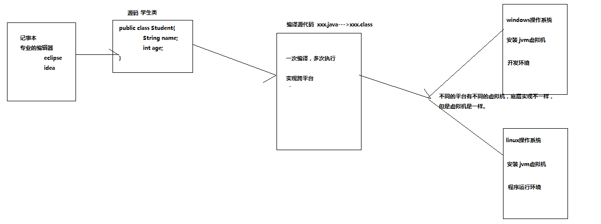
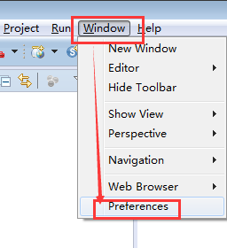
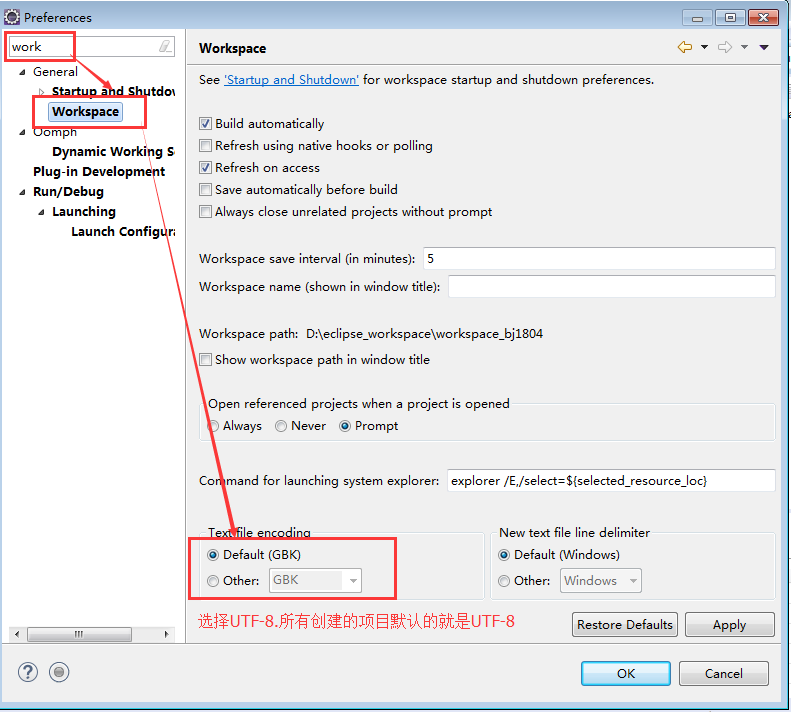
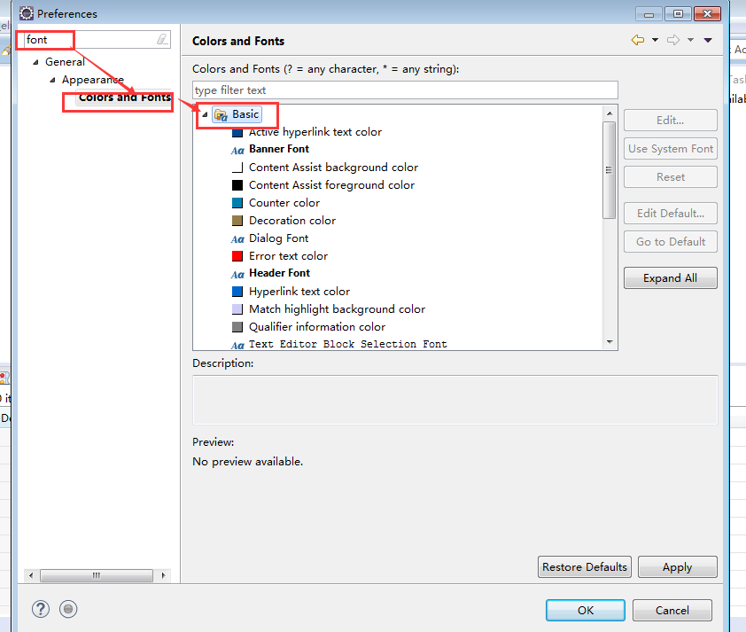
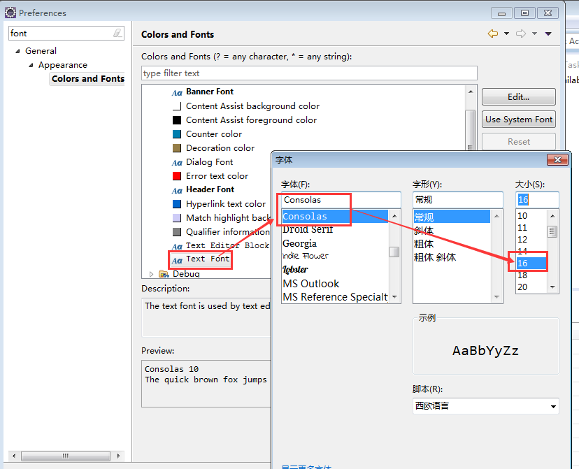
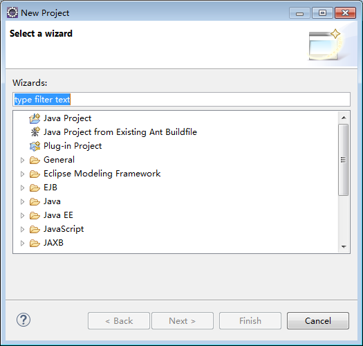
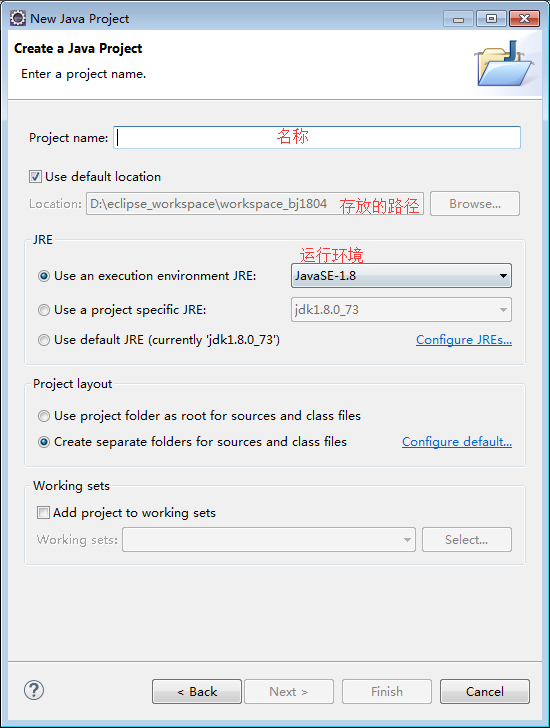

## 一、java简介-testxxx


### 1.java概述

​	学习之前需要了解——java是什么?java是sun公司推出的面向对象程序设计语言，特别适用于Interent应用程序开发,它的最大特点就是“一次编译，到处运行”,并且能够在各种操作系统上运行,例如:windows,linux等。

​	


### 2.java发展史


### 3.Java语言特点

```java
1.面向对象
	概念:类和对象
	三大特性:封装。继承。多态。（抽象）

2.健壮性
	吸取C,C++,将一些不稳定的因素去掉(指针，内容的申请与释放)

3.跨平台
	一次编译，多次运行。就是因为不同的平台都提供有对应的JVMJava虚拟机
```


### 4.java语言的构成


## 二、java快速入门


### 1、常用DOS命令

```xml
常用的DOS命令
dir（directory） :    列出当前目录下的文件以及文件夹
md（make directory） :   创建目录
rd（remove  directory） :     删除目录
cd（change directory）:    进入指定目录
cd.. :  退回到上一级目录
cd \:    退回到根目录
exit :   退出 dos 命令行
```


```xml
步骤(记事本):
	1.安装java运行环境(JDK)
	2.编写源代码
	3.编译源代码  javac
	4.运行编译后的class文件 java
```


### 4.1 配置环境变量（JDK）

```java
简单而言，使用  JDK  的提供的开发工具完成 java 程序的开发，使用 JRE 运行开发好的 Java 应用程序。

JDK(Java Development Kit    Java开发工具包)：JDK是提供给 Java 开发人员使用的，其中包含了 java 的开发工具，也包括了JRE。所以安装了JDK，就不用在单独安装JRE了
JRE(Java Runtime Environment    Java运行环境) ：包括Java虚拟机(JVM：Java Virtual Machine)和 Java 程序所需的核心类库等，如果想要运行一个开发好的Java程序，计算机中只需要安装JRE即可。

JDK包含了JRE,JRE包含了JVM.
```


配置环境变量:

```java
第一步:打开-计算机-属性-高级系统设置-环境变量-系统变量
第二步:进行配置（JAVA_HOME,PATH,CLASSPATH）
	a.JAVA_HOME:另似给jdk全路径取一个别名。然后使用的时候直接使用别名
	b.PATH:通过PATH,在DOS命令行找到对应的命令。java  javac 
	c.CLASSPATH:JDK1.5之后，可以选择性安装，建议安装。最前面一定要配置一个.(点)
参考配置如下:
```

```java
JAVA_HOME = C:\Program Files\Java\jdk1.8.0_73
PATH = %JAVA_HOME%\bin;%JAVA_HOME%\jre\bin;
CLASSPATH = .;%JAVA_HOME%\lib\dt.jar;%JAVA_HOME%\lib\tools.jar;
```


### 4.2编写源代码

```java
//HelloWorld由于被public 修饰，所有必须和文件名保持一致
public class HelloWorld{
//程序的入口
 public static void main(String[] args){
	//打印信息到控制台
	System.out.println("hello bj1804.....+++++");
 }
}
```


### 4.3编译

```java
编译HelloWorld.java文件，编译成功会生成HelloWorld.class文件
 - javac HelloWorld.java
运行
 - java HelloWorld
```

### 4.4案例


```java
public class Test01{
	public static void main(String [] args){
		System.out.println("-------------------------");
		//注释：是一个制表符  tab键
		System.out.println("\t欢迎光临家乐福西乡店");
		System.out.println("机:15 \t 人:1082 \t 单:7596");
		System.out.println("\t\t\t\t\tRMB");
		System.out.println("商品号\t110 清风抽取式面纸  \t\t25.30");
		System.out.println("商品号\t111 统一方便面  \t\t12.56");
		System.out.println("-------------------------");
		System.out.println("总价\t\t\t\t\t37.86");
		System.out.println("-------------------------");
		
	}
}

```


## 三、java语言的运行机制

```xml
1.JVM(java虚拟机)
2.GC(垃圾回收器)
```


### 2.1 JVM

```java
概念:JVM是一个虚拟的计算机，具有指令集并使用不同的存储区域。负责执行指令，管理数据、内存、寄存器

java是跨平台的语言(windows,linux,mac):
	怎么实现跨平台的:因为不同的操作系统（平台）拥有不同的虚拟机。

Java虚拟机机制屏蔽了底层运行平台的差别，实现了“一次编译，到处运行”。
```




### 2.2.GC 垃圾回收器

```java
1.系统开辟一个线程自动检测哪些对象不再被使用，然后将这些空闲的对象及资源进行回收。（c,c++需要手动回收）
2.在系统运行的时候，会自动去执行。我们人工无法精确的取控制和干预.
```


## 五、eclipse编译工具 使用

1.解压直接使用

2.第一次进来选择工作空间，就是存放代码的地方(建议放在D盘)

3.修改eclipse的编码方式(UTF-8:万国码，国标码:GB2312,GBK)






4.修改字体大小






5.新建项目







6.创建具体的java类

选中项目，然后先建class。然后设置class名称